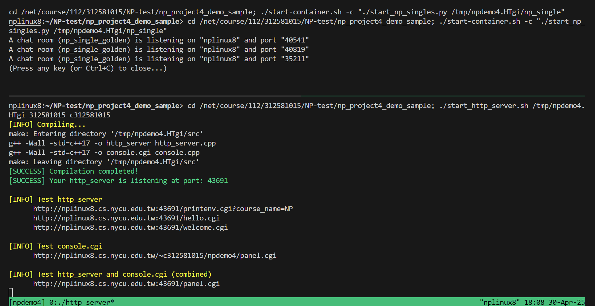
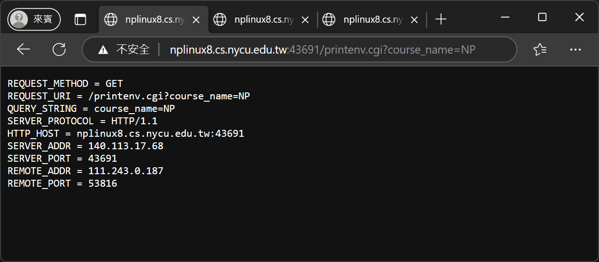
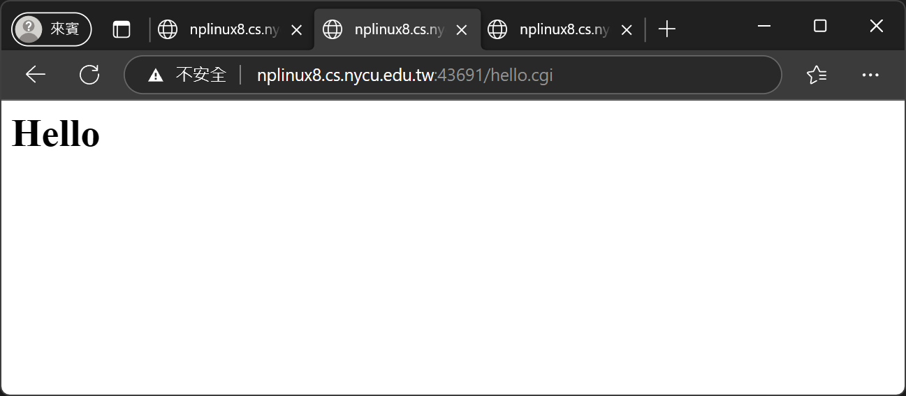
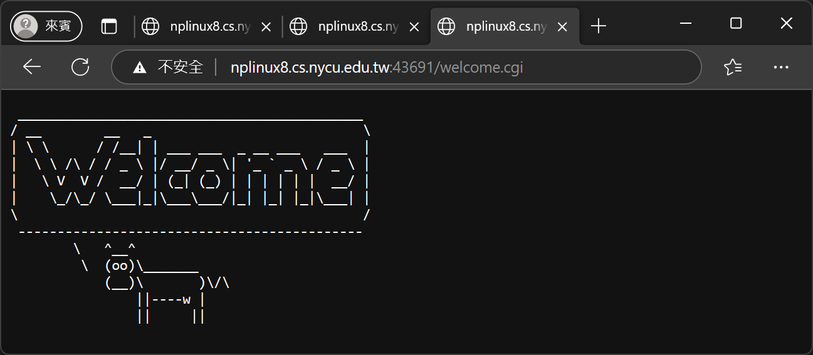
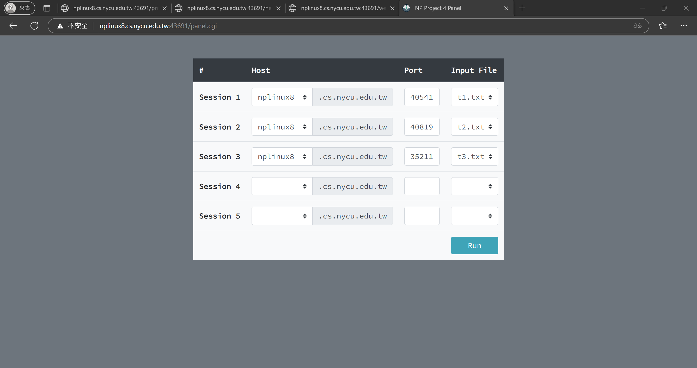
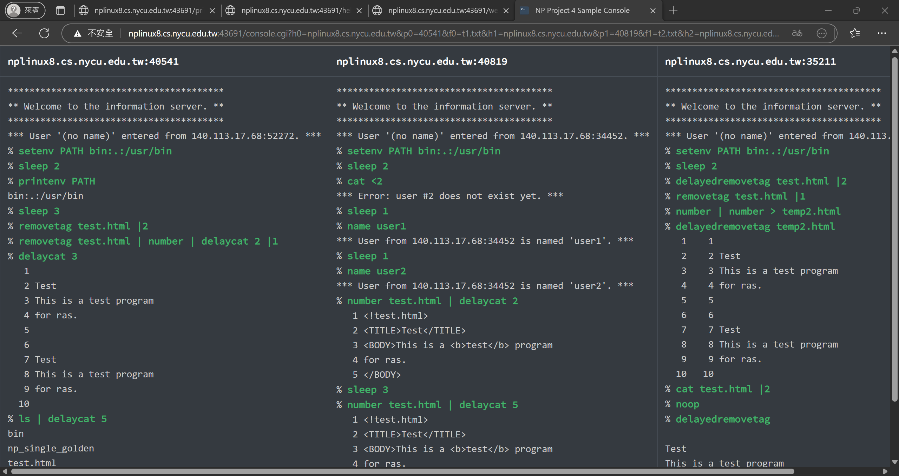

# NP Project4 Demo Script
## Important information:

This is a sample demo script for project 4.
It is just a sample, and the final one might be different.

## Usage
- You should put your source codes under `src/` before running `demo.sh`
    1. Create a folder naming by **your student id**.
    2. Put all source codes and Makefile in the folder created in step1.
    3. `src/0856000/` is just an example. You do not need to remove it.

- Run `./demo.sh [your student id]`
    - demo.sh create two panes in tmux
    - The upper pane
        - Execute three np_single_golden automatically.
        - The hostname and the port for listening will be displayed.
    - The lower pane
        - Compile your source codes.
        - Put the executables into the temporary directory
          (You can use `cat ~/.npdemo4` to get the path)
        - Copy CGI programs into `~/public_html/npdemo4/`
        - Execute your `http_server`
        - Display some links for demo
    - If the script successfully finishes, you will see the two panes similar to the below screenshot. You can open the links to check the result.
        
        

## Result
### http_server
- The results should be similar to the following screenshots
    - printenv.cgi

        

    - hello.cgi
        
        

    - welcome.cgi

        

    - panel.cgi

        

### console.cgi

