# NP Project5 Demo Script

## Important information:

This is a sample demo script for project 5.
It is just a sample, and the final one might be different.

## Usage

- You should put your source codes under `src/` before running `demo.sh`
    1. Create a folder naming by **your student id**.
    2. Put all source codes and Makefile in the folder created in step1.
    3. `src/0856000/` is just an example. You do not need to remove it.
- Run `./demo.sh [your student id]`
    - demo.sh create three panes in tmux
    - The upper pane
        - Execute three np_single_golden automatically.
        - The hostname and the port for listening will be displayed.
    - The lower left pane
        - Compile your source codes.
        - Put the executables into the temporary directory
        (You can use `cat ~/.npdemo5` to get the path)
        - Copy CGI programs into `~/public_html/npdemo5/`
        - Display some link for demo.
    - The lower right pane
        - Display the link to panel_socks.cgi on nplinux.
        - Press ENTER to set the socks.conf to permit all.
    - If the script successfully finishes, you will see the three panes similar to the below screenshot. You can open the links to check the result.
        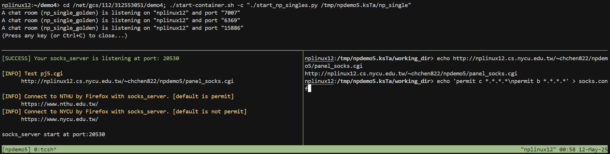
        

# Result

### Socks Server Connect

- First, you should configure Firefox's proxy settings to use the SOCKS server information provided in `demo.sh`.
    
    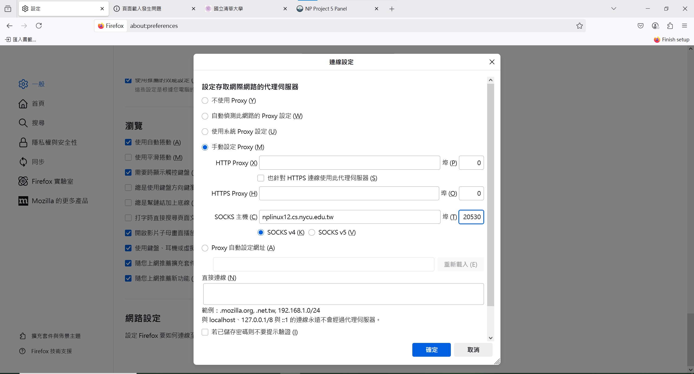
    
- Test NYCU, NTHU website
    - The default socks.conf configuration allows only NTHU IP to connect.
        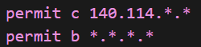
        
    1. Because only NTHU IP addresses are allowed, connections to NYCU should fail.
        
        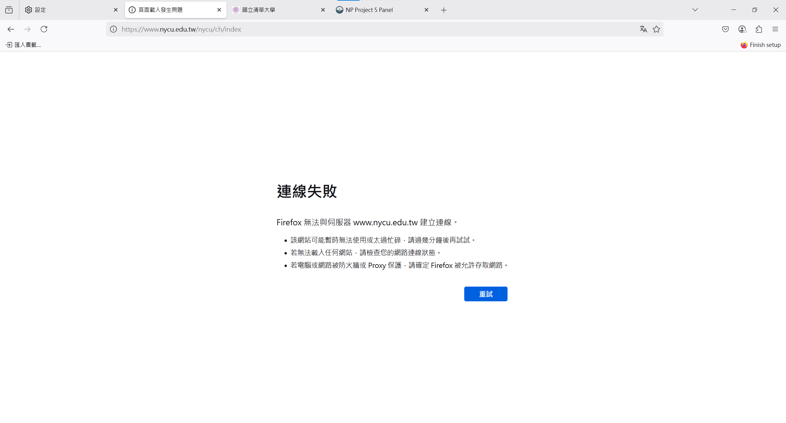
        
        The SOCKS server should output the **Reject**:
        
        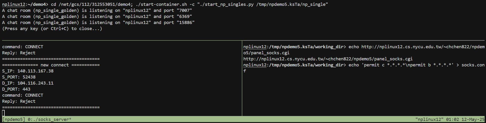
        
    2. NTHU IP addresses are allowed, connections to NTHU should success.
        
        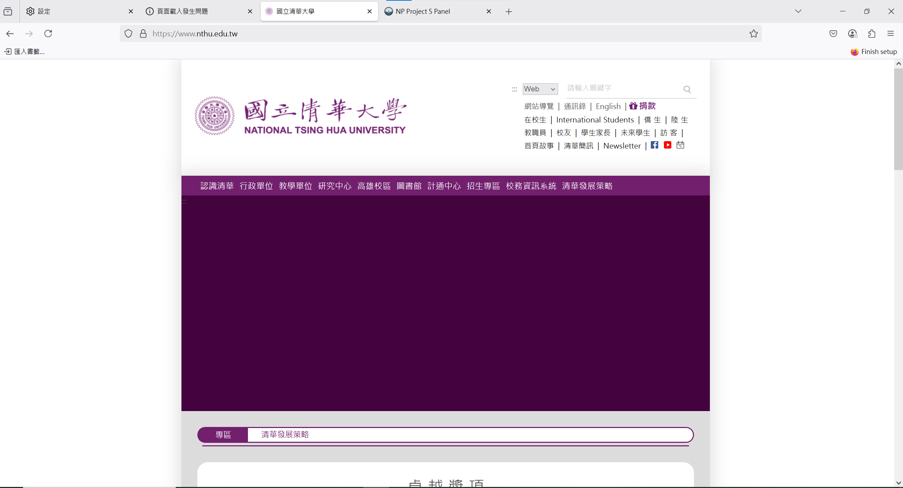
        
        The SOCKS server should output **Accept**. 
        Because the NTHU website loads resources from other origins, seeing many 'Reject' messages afterward is normal.
        
        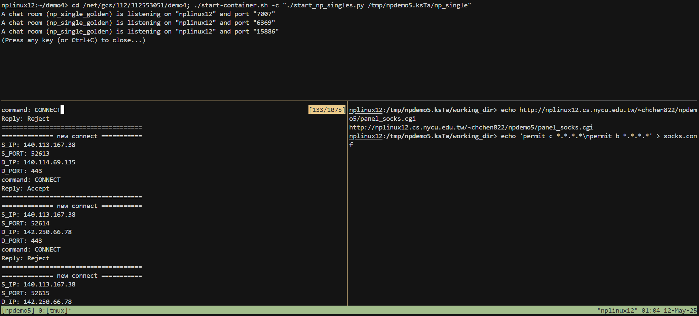
        
    3. In the bottom-right panel, press **Enter** to update `socks.conf` so that it allows all connections.
        
        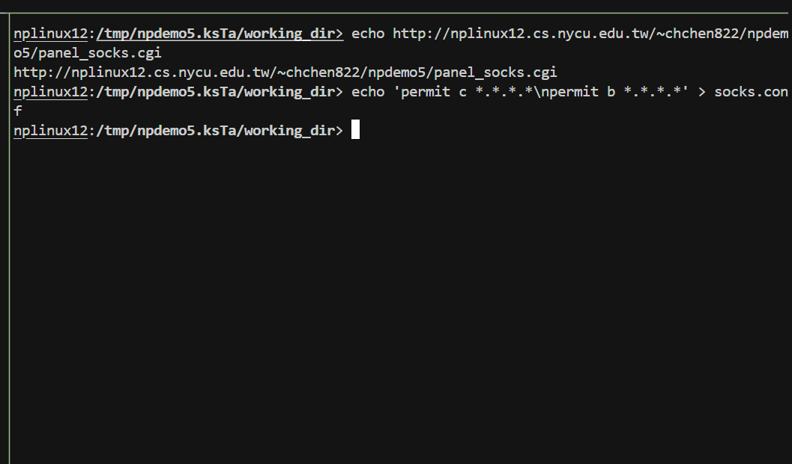
        
        NYCU connection should be accept.
        
        
        

### Socket Server Bind

1. Set your proxy first.
    
    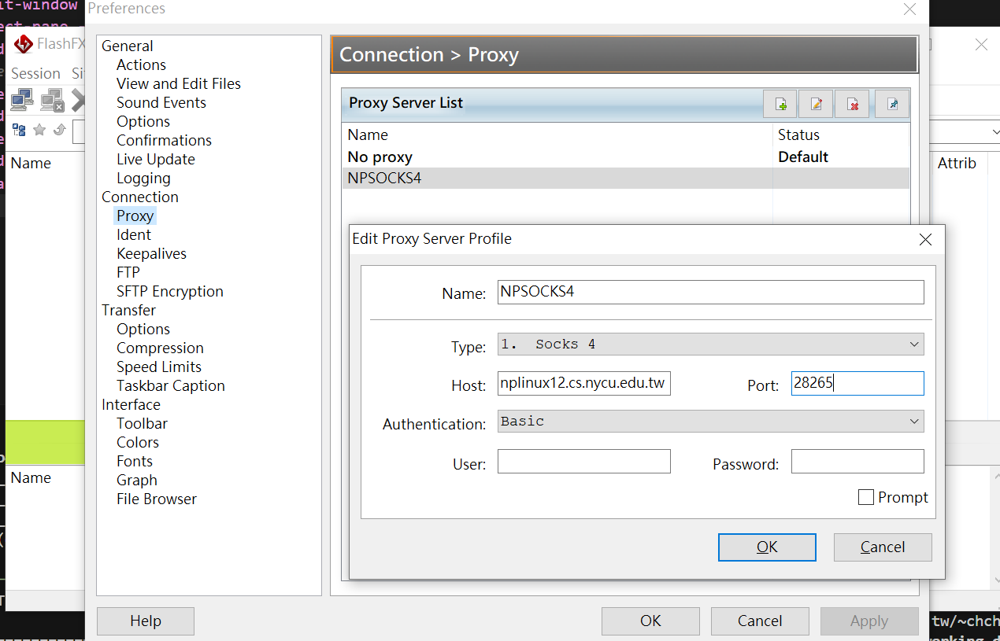
    
2. Connect to your FTP server
    
    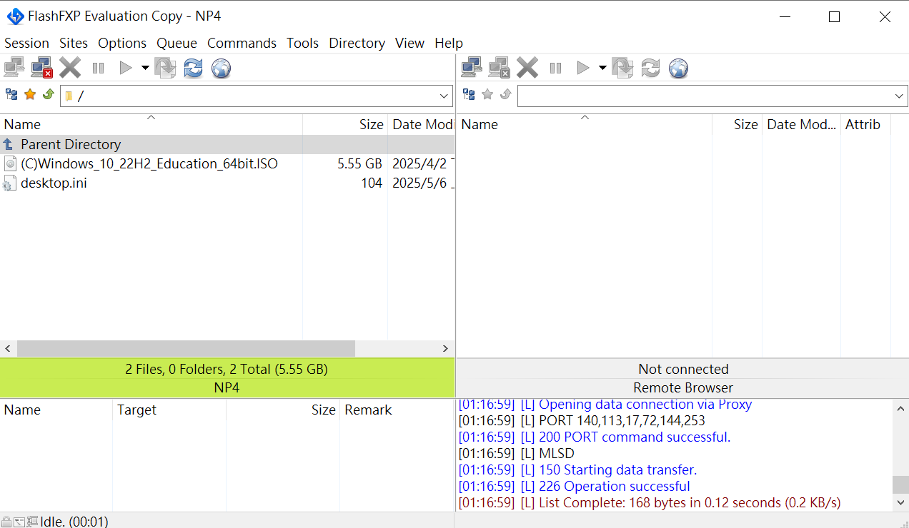
    
    Socks server should output bind **Accept**.
    
    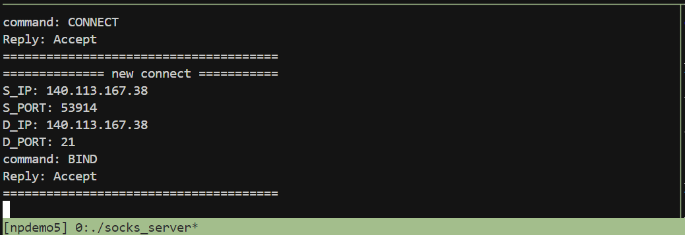
    
    Download file from FTP server
    
    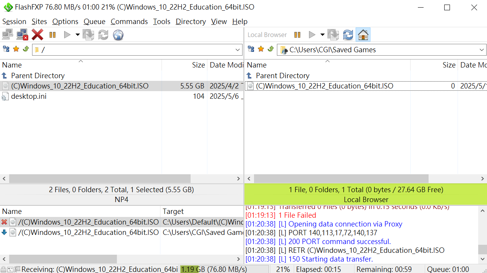
    

### 3. CGI proxy

1. Open the link provided by left bottom panel
    
    
    
2. Fill the information from demo.sh
    
    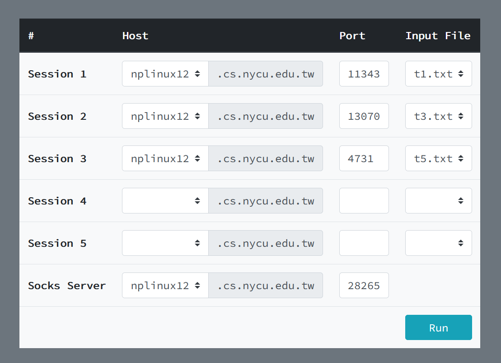
    
3. Should be able to execute the selected `.txt` file as shown below:
    
    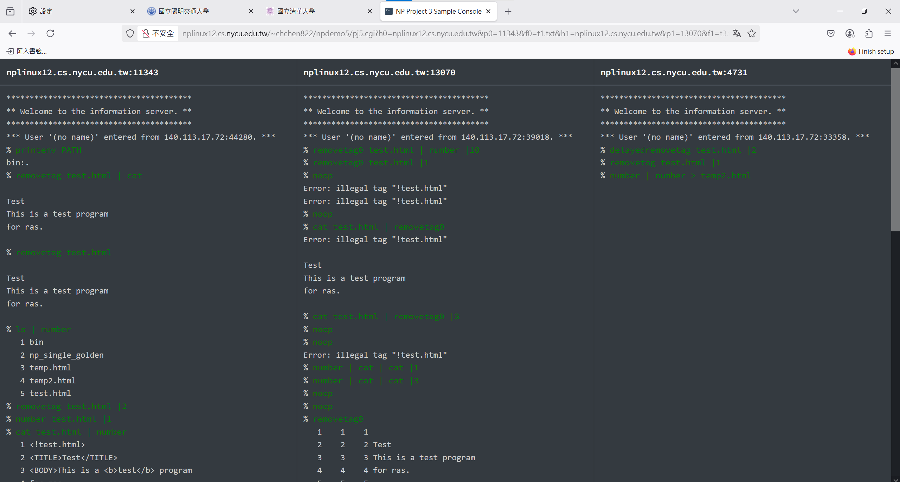